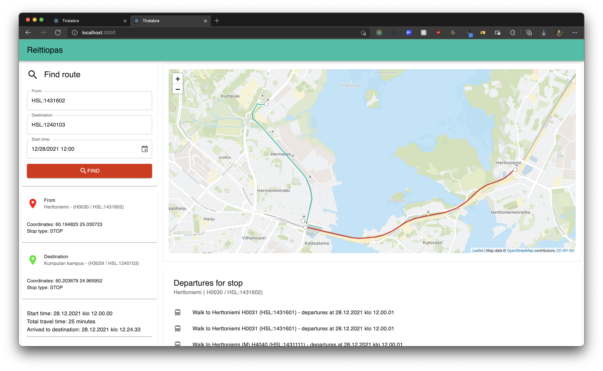
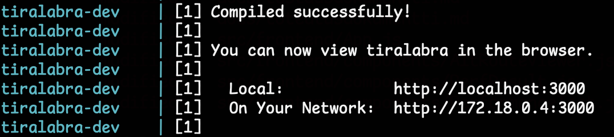

# Tiralabra

  

## Käyttöohjeet

Sovelluksen voi käynnistää komennolla `docker-compose up -d` sovelluksen juurikansiossa. Komennon suorittamiseksi vaaditaan vähintään docker-composen versio `v1.2.7` tai uudempi sekä dockerin versio `19.03.0` tai uudempi. Mikäli kääntämisessä ilmenee virheitä, varmista ensimmäisenä Dockerilla olevan oikeat käyttöoikeudet kansion tiedostoihin. Huomioi myös, että Docker voi vaatia root-oikeuksia toimiakseen.

Sovellus on käytettävissä hetken jälkeen osoitteesta `http://localhost:3000/`. Jos `localhost` ei vastaa logien ilmoitettua olevan käännetty, voi kokeilla logeista löytyvää ip-osoitetta.

Sovellus ohjaa käyttäjää reitin löytämiseksi. Reittihakurin kenttä tukee GTFS-muotoisia pysäkkitunnuksia. Huomioi, että päivämääräkenttä toimii ainoastaan valitsimen kautta, ja se tukee myös sekuntteja.

Kentät tukevat myös vapaasanahakumuotoisia hakutermejä rivin loppuun ilmestyvällä haku-painikkeella, joilla voidaan hakea lähialueen pysäkit listauksena. Tästä listauksesta voidaan valita haluttu pysäkki painamalla, jonka GTFS-id siirtyy hakukenttään.

Haettua reittiä voidaan tarkastella sekä karttanäkymästä, että hakukentän alle avautuvasta reitin kuvauksesta.

Pysäkiltä lähtevien linjojen tietoja voidaan tarkastella painamalla pysäkkisymbolia kartalta ja tämän jälkeen avautuvasta ikkunasta pysäkin nimeä oranssissa painikkeessa. Nämä tiedot ilmestyvät `Departures for stop` -osioon kartan alapuolelle.

**HOX!** Taustapalvelimena API-kutsuille käytettävä OTP:lle on allogoitu enimmillään 7 gigaa muistia Javan virtuaalikoneelle vähentääkseen sen äkkinäisiä kaatumisia muistin loppumisen takia.

Logit reitinhakusovelluksesta ja redis-cachesta komennolla `docker-compose logs -f app cache`.
OTP:n logit `docker-compose logs -f otp`.

Sulje sovellukset komennolla `docker-compose down -v`.

## Dokumentaatio

-   [Määrittelydokumentti](./docs/maarittelydokumentti.md)
-   [Testausdokumentti](./docs/testausdokumentti.md)
-   [Toteutusdokumentti](./docs/toteutusdokumentti.md)

## Viikkoraportit

-   [Viikko 1](./docs/viikkoraportit/viikko1.md)
-   [Viikko 2](./docs/viikkoraportit/viikko2.md)
-   [Viikko 3](./docs/viikkoraportit/viikko3.md)
-   [Viikko 4](./docs/viikkoraportit/viikko4.md)
-   [Viikko 5](./docs/viikkoraportit/viikko5.md)
-   [Viikko 6](./docs/viikkoraportit/viikko6.md)

## Lisensseistä

Projektissa käytetyt pysäkki- ja reittidatat ovat noudettu Helsingin Seudun Liikenteen tarjoamasta API-väylästä lisenssillä [Creative Commons BY 4.0 International](https://creativecommons.org/licenses/by/4.0/) ja näiden tietojen tekijänoikeus on **© Helsinki Region Transport 2021**.

Reittien geometriatiedot sekä käytetty karttadata ovat käytössä [Open Database License (ODbL)](https://opendatacommons.org/licenses/odbl/index.html) mukaisesti.
