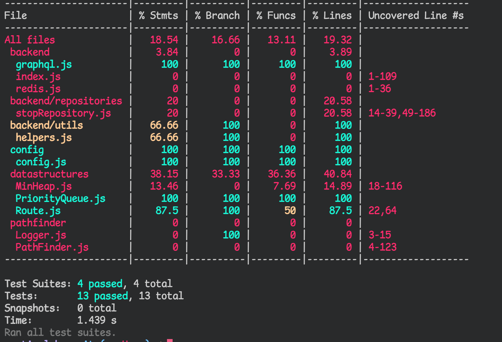

# Testausdokumentti

## Testauskattavuus

 

Yksikkötestauksessa tullaan huomioimaan taustapalvelimen (backend), tietorakenteiden ja reitinhakualgoritmin toiminta. Yksikkötestauskattavuuden ulkopuolelle jätetään käyttöliittymän koodi.

## Tekninen toteutus

Automaattiseen testaamiseen käytetään Jest-kirjastoa. Tämän lisäksi testausta suoritetaan manuaalisesti käyttöliittymän kautta tämän tarjotessa mahdollisuuden katsoa tarkemmin syntynyttä reittiä.

## Testien suorittaminen

Testit voi suorittaa komennolla `docker-compose run --rm app npm run test:coverage`.

## Kuinka testataan?

-   Prioriteettijonona toimiva [MinHeap](../src/datastructures/MinHeap.js)-luokka [(testit)](../src/datastructures/tests/MinHeap.test.js)

    -   Suoritetaan Jestin avulla simuloimalla minimikeon toimintaa tarkastelemalla, että keko rakentuu oikein, järjestettäessä keko palauttaa oikean tilanteen sekä pitää myös huolen, että alkuperäinen keko pysyy koko ajan haluttuna. Lisättäessä ja poistettaessa keosta tarkastellaan jokaisen poisto-operaation jälkeen, että keko pysyy vaatimuksien mukaisena.

-   Reittiä kuvaava [Route](../src/datastructures/Route.js)-luokka [(testit)](../src/datastructures/tests/Route.test.js)

    -   Suoritetaan Jestin avulla. Varmistetaan, että kentät palauttavat oikeat arvot sekä luokan metodit toimivat oikein.

-   Reitinhausta vastaava A\*-algoritmin toteuttava [PathFinder](../src/pathfinder/PathFinder.js) [(testit)](../src/pathfinder/tests/PathFinder.test.js)

    -   Suoritetaan Jestin avulla.
    -   Testataan sekä haversine-funktion toteuttava `distanceBetweenTwoPoints` että heuristiikan laskeva funktio `heuristic`, että palauttavat oikeat arvot.
    -   Reitinhaku testataan suorittamalla reitinhaku muutaman eri reittipisteen välillä sekä vertailemalla niitä HSL:n käyttämän OpenTripPlannerin laskemiin reitteihin A\*-algoritmillä asetuksin `vain bussit, vältä kävelyä`- tuloksiin. Täten saatavat reitit vastaavat toteuttamani algoritmin saamia suurin piirtein. Nämä tulokset ovat silti tarkastettu manuaalisesti, ja tehty tarvittavia muutoksia johtuen toteutukseni rajoituksista siirtyä muille lähipysäkeille esimerkiksi Tikkurilan matkakeskuksen kokonaisuudessa.
    -   Huomioitavaa, että `PathFinderin` kutsuma `StopRepository` on toteutettu mock-tiedostona, joka palauttaa kovakoodattuja arvoja, jotka ovat haettu ajamalla jokaista tarkasteluväliä 1000 pysäkin tarkastelun verran ja tallentamalla nämä StopRepositoryä kohden tehdyt kutsut välimuistiin, ja tekemällä dumpin sen pohjalta.
    -   Testattavat pysäkkivälit ovat:
        -   HSL:4620205 (Urheilutie V6205) ja HSL:1240118 (Kumpulan kampus H3028) lähtöajalla 6.12.2021 klo 1200
        -   HSL:9650105 (Kievari Tu6041) ja HSL:4510255 (Osuustie V5155) lähtöajalla 6.12.2021 klo 1200
        -   HSL:1402157 (Porvarintie H3340) ja HSL:1320295 (Vanha Hämeenkyläntie H1581) lähtöajalla 6.12.2021 klo 1200

-   Avustajafunktioita tarjoava [helpers](../src/backend/utils/helpers.js) [(testit)](../src/backend/tests/helpers.test.js)

    -   Suoritetaan Jestin avulla ja varmistetaan, että avustajafunktiot palauttavat oikeat arvot

-   Reitti- ja pysäkkitietojen noutamisesta API-väylästä ja muotoilemisesta vastaava [StopRepository](../src/backend/repositories/stopRepository.js) [(testit)](../src/backend/tests/stopRepository.test.js)
    -   Testaus keskeneräinen, eikä toteutettu.
