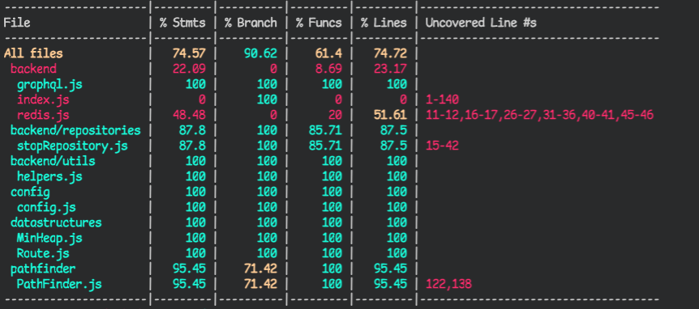

# Testausdokumentti

## Testauskattavuus

 [](https://codecov.io/gh/FinThunderstorm/tiralabra)

Testikattavuus viikolla 5 ajettaessa OTP-instanssia vasten tajuttuani selvitellessäni StopRepositoryn korkeaa testikattavuutta. Samalla huomasin Mockin kellonaikojen olevan pielessä ainakin osalla pysäkeistä 36 sekunttia.


Yksikkötestauksessa tullaan huomioimaan taustapalvelimen (backend), tietorakenteiden ja reitinhakualgoritmin toiminta. Yksikkötestauskattavuuden ulkopuolelle jätetään käyttöliittymän koodi.

## Tekninen toteutus

Automaattiseen yksikkötestaamiseen käytetään Jest-kirjastoa. Tämän lisäksi testausta suoritetaan manuaalisesti käyttöliittymän kautta tämän tarjotessa mahdollisuuden katsoa tarkemmin syntynyttä reittiä.

Suorituskykytestaaminen toteutetaan vertailemalla hakemiseen kuluvaa aikaa. Suorituskykytestauksen menetelmästä kerrotaan tarkemmin kohdassa _”Suorituskykytestaus”_.

## Testien suorittaminen

### Yksikkötestit

Yksikkötestit voi suorittaa komennolla `docker-compose run --rm app npm run test:coverage`.

### Suorituskykytestit

Suorituskykytestauksen voi suorittaa tekemällä pyynnön backendin endpointiin `http://localhost:3001/performanceTest` sisällyttämällä `application/json` muotoisen bodyn mukaan:

```
{
    "startStop": "HSL:4620205",
    "endStop": "HSL:1240118",
    "startTime": "2021-12-10T12:15:00.000Z"
}
```

Tässä `startStop` kuvaa lähtöpysäkin id:tä gtfs-formaatissa, `endStop` kuvaa päätepysäkin id:tä gtfs-formaatissa ja `startTime` kuvaa reitin haun lähtöaikaa. Esitettävä tässä formaatissa, mutta huolehdittava olevan aina tulevaisuudessa reitin löytymiseksi. `results` kohtaan annettavalla totuusarvolla avulla voidaan säädellä halutaanko tulokseen sisällytettävän tarkemmat tulokset, vai ainoastaan kavennettu tulos.

Voidaan suorittaa esimerkiksi seuraavalla curl-komennolla:

```
curl -X POST http://localhost:3001/performanceTest \
     -H 'Content-Type: application/json' \
     -d '{
            "startStop": "HSL:4620205",
            "endStop": "HSL:1240118",
            "startTime": "2021-12-10T12:15:00.000Z"
        }'
```

## Suorituskykytestaus

Suorituskykytestaaminen toteutetaan vertailemalla hakemiseen kuluvaa aikaa. Suorituskykytestin aikana haetaan reitti kurssin aikana kirjoitetulla A\*-algoritmillä ja myös taustapalvelimena toimivalta OpenTripPlanerilta, jonka `v1` käyttää reitinhakuun A\*-algoritmiä. Näiden suoritukseen kulunutta aikaa vertaillaan toisiinsa.

Suorituskykytestauksen voi suorittaa tekemällä pyynnön backendin endpointiin `http://localhost:3001/performanceTest` sisällyttämällä `application/json` muotoisen bodyn mukaan. Tarkempi kuvaus suorittamisesta löytyy kohdasta _”Testien suorittaminen”_

Lopputulos on esitetty JSON-muodossa, missä avaimen `results` takaa löytyy sekä vertailtavan OpenTripPlanerin tulos kohdasta `otp` ja kurssin aikana kirjoitetun PathFinderin kohdasta `pathfinder`.
Itse aikavertailu löytyy avaimen `took` takaa. Ajat on esitetty sekunteissa.

```
took: {
    otp: 0.2496978460000828,
    pathfinder: 1.8437993910005317,
    resultText: 'OTP took 0.250 seconds and PathFinder took 1.844 seconds',
    comparation:
        'PathFinder was 86.457% slower than optimized OpenTripPlanner\n -> Time difference was 1.594 seconds.',
}
```

## Kuinka testataan?

-   Prioriteettijonona toimiva [MinHeap](../src/datastructures/MinHeap.js)-luokka [(testit)](../src/datastructures/tests/MinHeap.test.js)

    -   Suoritetaan Jestin avulla simuloimalla minimikeon toimintaa tarkastelemalla, että keko rakentuu oikein, järjestettäessä keko palauttaa oikean tilanteen sekä pitää myös huolen, että alkuperäinen keko pysyy koko ajan haluttuna. Lisättäessä ja poistettaessa keosta tarkastellaan jokaisen poisto-operaation jälkeen, että keko pysyy vaatimuksien mukaisena.

-   Reittiä kuvaava [Route](../src/datastructures/Route.js)-luokka [(testit)](../src/datastructures/tests/Route.test.js)

    -   Suoritetaan Jestin avulla. Varmistetaan, että kentät palauttavat oikeat arvot sekä luokan metodit toimivat oikein.

-   Reitinhausta vastaava A\*-algoritmin toteuttava [PathFinder](../src/pathfinder/PathFinder.js) [(testit)](../src/pathfinder/tests/PathFinder.test.js)

    -   Suoritetaan Jestin avulla.
    -   Testataan sekä haversine-funktion toteuttava `distanceBetweenTwoPoints` että heuristiikan laskeva funktio `heuristic`, että palauttavat oikeat arvot.
    -   Reitinhaku testataan suorittamalla reitinhaku muutaman eri reittipisteen välillä sekä vertailemalla niitä HSL:n käyttämän OpenTripPlannerin laskemiin reitteihin A\*-algoritmillä asetuksin `vain bussit, vältä kävelyä`- tuloksiin. Täten saatavat reitit vastaavat toteuttamani algoritmin saamia suurin piirtein. Nämä tulokset ovat silti tarkastettu manuaalisesti, ja tehty tarvittavia muutoksia johtuen toteutukseni rajoituksista siirtyä muille lähipysäkeille esimerkiksi Tikkurilan matkakeskuksen kokonaisuudessa tai muille rajoitteille, jotka johtuvat OTP:n ja toteuttamani haun eroavaisuuksista.
    -   Huomioitavaa, että `PathFinderin` kutsuma `StopRepository` on toteutettu mock-oliona, joka palauttaa kovakoodattuja arvoja, jotka ovat haettu ajamalla jokaista tarkasteluväliä kolmen eri reitin tarkastelun verran ja tallentamalla nämä StopRepositoryä kohden tehdyt kutsut välimuistiin, ja tekemällä kovakoodatun testidumpin sen pohjalta. Täten kovakoodattu testidumppi pysyy järkevänä.
    -   Testausta ei voi suorittaa todellista OTP-instanssia vasten, sillä se ei osaa hakea yli päivän menneisyydessä oleville kellonajoille lähtötietoja.
    -   Testattavat pysäkkivälit ovat:
        -   HSL:4620205 (Urheilutie V6205) ja HSL:1240118 (Kumpulan kampus H3028) lähtöajalla 15.12.2021 klo 1215
        -   HSL:9650105 (Kievari Tu6041) ja HSL:4510255 (Osuustie V5155) lähtöajalla 15.12.2021 klo 1305
        -   HSL:1361108 (Maaherrantie H3076) ja HSL:1150110 (Haartmaninkatu H1322) lähtöajalla 15.12.2021 klo 1305
        -   HSL:1431187 (Herttoniemi (M) H4006) ja HSL:1304161 (Munkkivuoren ostosk. H1432) lähtöajalla 15.12.2021 klo 1300
    -   Suorituskykytestaus on kuvattu tarkemmin kohdassa _”Suorituskykytestaus”_.

-   Avustajafunktioita tarjoava [helpers](../src/backend/utils/helpers.js) [(testit)](../src/backend/tests/helpers.test.js)

    -   Suoritetaan Jestin avulla ja varmistetaan, että avustajafunktiot palauttavat oikeat arvot

-   Reitti- ja pysäkkitietojen noutamisesta API-väylästä ja muotoilemisesta vastaava [StopRepository](../src/backend/repositories/stopRepository.js) [(testit)](../src/backend/tests/stopRepository.test.js)
    -   Testaus keskeneräinen, eikä toteutettu.
