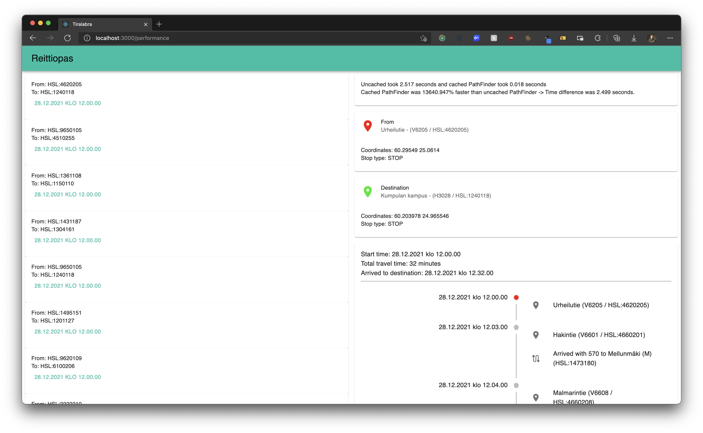

# Testausdokumentti

## Testauskattavuus

[](https://github.com/FinThunderstorm/tiralabra/actions/workflows/main.yml) [](https://codecov.io/gh/FinThunderstorm/tiralabra)

Yksikkötestauksessa tullaan huomioimaan tietorakenteiden ja reitinhakualgoritmin toiminta. Yksikkötestauskattavuuden ulkopuolelle jätetään käyttöliittymän koodi. API:sta haettavan tiedon osalta yksikkötestausta tullaan suorittamaan ainoastaan itse tehdylle muuntamiselle API:n omasta muodosta algoritmin käyttämään muotoon.

Yksikkötestauksen kattavuusraportti löytyy [Codecovista.](https://codecov.io/gh/FinThunderstorm/tiralabra)

## Tekninen toteutus

Automaattiseen yksikkötestaamiseen käytetään Jest-kirjastoa. Tämän lisäksi testausta suoritetaan manuaalisesti käyttöliittymän kautta tämän tarjotessa mahdollisuuden katsoa tarkemmin syntynyttä reittiä.

Suorituskykytestaaminen toteutetaan vertailemalla hakemiseen kuluvaa aikaa. Suorituskykytestauksen menetelmästä kerrotaan tarkemmin kohdassa _”Suorituskykytestaus”_.

## Testien suorittaminen

### Yksikkötestit

Yksikkötestit voi suorittaa komennolla `npm run test:coverage`.

### Suorituskykytestit

Suorituskykytestauksen voi suorittaa tekemällä pyynnön backendin endpointiin `http://localhost:3001/performanceTest` sisällyttämällä `application/json` muotoisen bodyn mukaan:

```
{
    "startStop": "HSL:4620205",
    "endStop": "HSL:1240118",
    "startTime": "2021-12-10T12:15:00.000Z"
}
```

Tässä `startStop` kuvaa lähtöpysäkin id:tä gtfs-formaatissa, `endStop` kuvaa päätepysäkin id:tä gtfs-formaatissa ja `startTime` kuvaa reitin haun lähtöaikaa. Esitettävä annetussa ISO-formaatissa, mutta huolehdittava olevan tulevaisuudessa oleva aika reitin löytymiseksi. `results` kohtaan annettavalla totuusarvolla avulla voidaan säädellä halutaanko tulokseen sisällytettävän tarkemmat tulokset, vai ainoastaan kavennettu tulos.

Voidaan suorittaa esimerkiksi seuraavalla curl-komennolla:

```
curl -X POST http://localhost:3001/performanceTest \
     -H 'Content-Type: application/json' \
     -d '{
            "startStop": "HSL:4620205",
            "endStop": "HSL:1240118",
            "startTime": "2021-12-10T12:15:00.000Z"
        }'
```

Vaihtoehtoisesti `http://localhost:3000/performance` takaa löytyy graaffinen käyttölittymä, josta löytyy muutamia erilaisia pysäkkivälejä. Kovakodattu jokaiselle pysäkkivälille seuraavan päivän klo 1200 lähtöajaksi.



## Suorituskykytestaus

Suorituskykytestaaminen toteutetaan vertailemalla hakemiseen kuluvaa aikaa. Suorituskykytestin aikana haetaan reitti kurssin aikana kirjoitetulla A\*-algoritmillä. Ensimmäiseltä ja yhdeksänneltä reitinhaulta otetaan tulokset ylös. Näiden suoritukseen kulunutta aikaa vertaillaan toisiinsa. Yhdeksäs reitinhaku edustaa tulosta, jossa on lähes kaikki API-väylästä johtuvat hitaudet eliminoitu pois, ja saadaan algoritmin todellinen nopeus selville.

Suorituskykytestauksen voi suorittaa tekemällä pyynnön backendin endpointiin `http://localhost:3001/performanceTest` sisällyttämällä `application/json` muotoisen bodyn mukaan. Tarkempi kuvaus suorittamisesta löytyy kohdasta _”Testien suorittaminen”_

Lopputulos on esitetty JSON-muodossa, missä avaimen `route` takaa löytyy välimuistia hyödyntäneen reittihaun tulos ja `uncachedRoute` takaa löytyy ensimmäinen, välimuistia hyödyntämätön reittihaun tulos.
Itse aikavertailu löytyy avaimen `took` takaa. Ajat on esitetty sekunteissa.

```
"took": {
        "uncachedPathfinder": 1.42591421700269,
        "pathfinder": 0.008076122000813485,
        "resultText": "Uncached took 1.426 seconds and cached PathFinder took 0.008 seconds",
        "comparation": "Cached PathFinder was 17555.927% faster than uncached PathFinder\n -> Time difference was 1.418 seconds."
    }
```

## Kuinka testataan?

-   Prioriteettijonona toimiva [MinHeap](../src/datastructures/MinHeap.js)-luokka [(testit)](../src/datastructures/tests/MinHeap.test.js)

    -   Suoritetaan Jestin avulla simuloimalla minimikeon toimintaa tarkastelemalla:
        -   keko rakentuu oikein, järjestettäessä keko palauttaa oikean tilanteen
        -   pitää myös huolen, että alkuperäinen keko pysyy koko ajan haluttuna.
        -   Lisättäessä ja poistettaessa keosta tarkastellaan jokaisen poisto-operaation jälkeen, että keko pysyy vaatimuksien mukaisena.

-   Reittiä kuvaava [Route](../src/datastructures/Route.js)-luokka [(testit)](../src/datastructures/tests/Route.test.js)

    -   Suoritetaan Jestin avulla.
    -   Varmistetaan, että kentät palauttavat oikeat arvot sekä luokan metodit toimivat oikein.

-   Reitinhausta vastaava A\*-algoritmin toteuttava [PathFinder](../src/pathfinder/PathFinder.js) [(testit)](../src/pathfinder/tests/PathFinder.test.js)

    -   Suoritetaan Jestin avulla.
    -   Yksikkötestauksella suoritetaan myös reitinhaun oikeellisuustestaus.
    -   Testataan heuristiikan laskeva funktio `heuristic`, että palauttavat oikeat arvot.
    -   Reitinhaku testataan suorittamalla reitinhaku eri reittipisteen välillä sekä vertailemalla niitä HSL:n käyttämän OpenTripPlannerin laskemiin reitteihin A\*-algoritmillä asetuksin `vain bussit, vältä kävelyä`- tuloksiin ensimmäisen neljän kohdalla. Jälkimmäiset kuusi testitapausta ovat normaali OpenTripPlanerin reittihaun tuloksini verraten tarkastettu asetuksella `vältä kävelyä`.
    -   Huomioitavaa, että `PathFinderin` kutsuma `StopRepository` on toteutettu mock-oliona, joka palauttaa kovakoodattuja arvoja, jotka ovat haettu ajamalla jokaista tarkasteluväliä kolmen eri reitin tarkastelun verran ja tallentamalla nämä StopRepositoryä kohden tehdyt kutsut välimuistiin, ja tekemällä kovakoodatun testidumpin sen pohjalta. Täten kovakoodattu testidumppi pysyy järkevänä.
    -   Kovakoodatun datan lähde on **HSL** ja **© Helsinki Region Transport 2021** käyttöoikeudella [**CC BY 4.0 International**](https://creativecommons.org/licenses/by/4.0/).
    -   Testausta ei voi suorittaa todellista OTP-instanssia vasten, sillä se ei osaa hakea yli päivän menneisyydessä oleville kellonajoille lähtötietoja.
    -   Testattavat pysäkkivälit ovat:
        -   Urheilutie (V6205 / HSL:4620205) ja Kumpulan kampus (H3028 / HSL:1240118 ) lähtöajalla 15.12.2021 klo 1215
        -   Kievari (Tu6041 / HSL:9650105) ja Osuustie (V5155 / HSL:4510255) lähtöajalla 15.12.2021 klo 1305
        -   Maaherrantie (H3076 / HSL:1361108) ja Haartmaninkatu (H1322 / HSL:1150110) lähtöajalla 15.12.2021 klo 1305
        -   Herttoniemi (M) (H4006 / HSL:1431187) ja Munkkivuoren ostosk. (H1432 / HSL:1304161) lähtöajalla 15.12.2021 klo 1300
        -   Rautatieasema - (H0302 / HSL:1020454) ja Länsiterm. T1 - (H0235 / HSL:1203409) lähtöajalla 28.12.2021 klo 1205
        -   Kumpulan kampus - (H0326 / HSL:1240419) ja Erottaja - (H0802 / HSL:1040445) lähtöajalla 28.12.2021 klo 1205
        -   Herttoniemi - (H0030 / HSL:1431602) ja Kumpulan kampus - (H3029 / HSL:1240103) lähtöajalla 28.12.2021 klo 1205
        -   Tikkurila - (V0618 / HSL:4610553) ja Ilmalantori - (H2087 / HSL:1171180) lähtöajalla 28.12.2021 klo 1200
        -   Ruoholahti - (H0015 / HSL:1201601) ja Kaivopuisto - (H0437 / HSL:1070418) lähtöajalla 28.12.2021 klo 1210
        -   Matinkylä - (E0011 / HSL:2314601) ja Koivusaarentie - (H1039 / HSL:1310119) lähtöajalla 28.12.2021 klo 1210
    -   Suorituskykytestaus on kuvattu tarkemmin kohdassa _”Suorituskykytestaus”_.

-   Avustajafunktioita tarjoava [helpers](../src/backend/utils/helpers.js) [(testit)](../src/backend/tests/helpers.test.js)

    -   Suoritetaan Jestin avulla ja varmistetaan, että avustajafunktiot palauttavat oikeat arvot sekä haversine-funktion toteuttavan `distanceBetweenTwoPoints` palauttamat arvot ovat oikeellisia.

-   Reitti- ja pysäkkitietojen noutamisesta API-väylästä ja muotoilemisesta vastaava [StopRepository](../src/backend/repositories/stopRepository.js) [(testit)](../src/backend/tests/stopRepository.test.js)
    -   Yksikkötestein on katettu niiden toiminnallisuuksien osuudet, joilla haetaan tietoa API-välyästä reitinhaun yhteydessä. Käyttöliittymän tarvitsemia osuuksia ei ole testattu.
