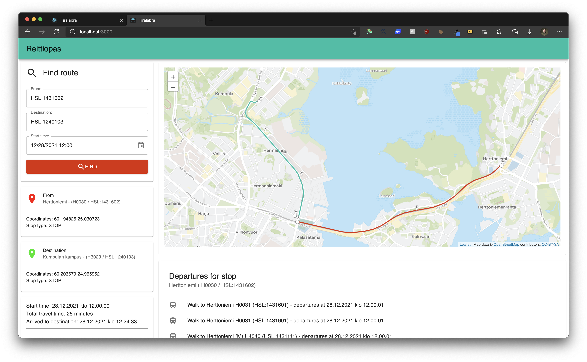

# Toteutusdokumentti

## Käytettävät tietorakenteet ja algoritmit

Reitinhaku on toteutettu käyttäen A\*-algoritmiä. A\*-algoritmi on kehittyneempi versio Djikstran algoritmistä. A\*-algoritmissä reittiä haetaan pysäkki kerrallaan lisäämällä pysäkkejä prioriteettijonoon. Prioriteettijonosta valitaan aina pienimmällä matka-ajalla varustettu reitti tarkastelua varten.

Matka-aika lasketaan tähän astisen matka-ajan, todellisen matka-ajan seuraavaan kohteeseen ja heuristisen arvion perusteella perille pohjalta. Heuristisessa arviossa käytetään eri joukkoliikennevälineiden keskinopeuksia ja kahden pysäkin välinen aika lasketaan koordinaateista haversine-funktiolla. Tällöin heuristinen arvio saa aikamuotoisen arvion. Heuristinen arvio on A\*-algoritmin isoin eroavaisuus Djikstraan nähden.

Lisäksi A\*-algoritmi lopettaa reitin etsimisen, kun haluttu määrä reittejä on löytynyt. Jos halutaan löytää yksi reitti, lopetetaan reitinhaku ensimmäisen löytyneen reitin jälkeen.

A\*-algoritmin tarvitsema prioriteettijono on toteutettu käyttäen minimikekoa. Minimikeossa pienin arvo on aina ensimmäisenä taulukossa ja itse taulukko noudattelee lähes täydellistä binääripuuta. Lisättäessä uusi arvo se binääripuun haara tarkastellaan läpi, johon uusi arvo lisätään, sekä tarvittaessa vaihdetaan arvojen paikkoja listalla.

## Käytettävät tekniikat

Ohjelmisto on toteutettu käyttäen Javascriptiä ohjelmointikielenä. Ohjelmistoa pyöritetään Docker-konteissa.

-   Reitinhaku: NodeJS
-   Välimuisti: Redis
-   Tietolähde: OpenTripPlanner

## Ohjelmiston yleinen rakenne

Docker-ympäristössä on kolme konttia, itse reitinhaku, Redis-välimuisti ja OpenTripPlanner, joka toimii sovelluksen tietolähteenä. OTP tarjoaa paikallisen API-väylän HSL:n avoimeen dataan ilman HSL:n tuotannossa olevan API:n kuormittamista. Merkityt portit ovat kontista ulospäin olevia portteja. Docker-ympäristön sisällä OpenTripPlanner vastaa portista 8080.

Reitinhaku on toteutettu siten, että reitinhakukontissa on erikseen frontend ja backend. Frontend kutsuu backendia RESTful API:n ylitse. Backend hakee GraphQL-muotoisesta API-väylästä tietoa OTP:sta.

Koodi on kommentoitu käyttäen JSDoc-formaattia sekä backendin tarjoamat reitit käyttäen Swaggerin OpenAPI-formaattia. API-väylän dokumentaatio on löydettävissä ohjelman pyöriessä `http://localhost:3001/apidocs` löytyvästä Swagger UI:sta.

## Saavutetut aika- ja tilavaativuudet

A\*-algoritmillä saavutetaan aika- ja tilavaatimuksiltaan määritelydokumentissa annetut rajat. Nämä ovat täysin reittikohtaisia, sillä lukumäärään vaikuttaa suuresti jokaiselta tarkasteltavalta pysäkiltä lähtevien linjojen ja vaihtopysäkkien määrä, sekä löydetyn reitin kaarien määrä. Annettuun ylärajaan päästään.

Minimikeko noudattelee määrittelydokumentissa asetettuja arvoja aika- ja tilavaatimuksille.

## Työn mahdolliset puutteet ja parannusehdotukset

-   Swagger UIn dokumentaatioon olioille viittauksina schemoja. Tällöin olisi index.js -tiedoston pituus huomattavasti vähemmän.
-   Reitinhakualgoritmin kehittäminen tulostamaan useampia tuloksia, sekä preferoimaan vähemmällä vaihdolla olevia reittejä.
-   Refaktorointia. Koodista löytyy paljon metodeja, joissa on osittain vanhoja ja tarpeettomia argumenttejä, sekä monia metodeita yhdistelemällä viisaammiksi kokonaisuuksiksi päästäisiin järkevämpiin lopputuloksiin. Nämä havaittiin loppuvaiheessa projektia, ja ei ollut kannattava lähteä enää tekemään laaja-alaista refaktorointia.
-   Selkeämpi koodaustapa, nyt ajoittain on sekaisin async/await ja Promisien rakennetta johtuen toinen ei toiminutkaan jostain syystä. Tästä syystä käytetty ensimmäisenä toimimaan saanutta ratkaisua.
-   Heuristisen arvioinnin kehittämistä paremmaksi tämän artikkelin pohjalta:
    -   Patel A, 2021, ”Improving Heuristics”, luettu 28.12.2021. Saatavilla: (https://www.redblobgames.com/pathfinding/heuristics/differential.html)
-   Reitinhaun kehittäminen siten, että voidaan hakea useammalla lähtö- ja kohdepisteellä antaen vain lähtökoordinaatit. Tämä voi tuottaa huomattavasti viisaampia reittiyhdistelmiä, kuten turhia vaihtoja vain päästäkseen yhtä kaukana kohteesta olevalle toiselle pysäkille.

## Lähteet

-   Patel A, 2021, ”Introduction to A\*”, luettu 6.11.2021. Saatavilla: (http://theory.stanford.edu/~amitp/GameProgramming/AStarComparison.html)
-   Patel A, 2020, ”Introduction to the A\* Algortihm”, luettu 6.11.2021. Saatavilla: (https://www.redblobgames.com/pathfinding/a-star/introduction.html)
-   Stein C & et al., 2009, ”Introduction to algorithms”. The MIT Press.
-   Chamberlain B, 2001, "Q5.1: What is the best way to calculate the distance between 2 points?", luettu 3.12.2021. Saatavilla: (https://web.archive.org/web/20041108132234/http://www.census.gov/cgi-bin/geo/gisfaq?Q5.1)
-   Jompero S, 2020, ”Helsingin uusin ratikkalinja on myös hitain, keskinopeus 12 km/h – "Joskus odotusaika voi olla parikymmentäkin minuuttia"”, luettu 11.11.2021. Saatavilla: (https://www.helsinginuutiset.fi/paikalliset/1199214)
-   Alku A, 2009, ”Joukkoliikennevälineiden keskinopeudet”, luettu 11.11.2021. Saatavilla: (http://jlf.fi/f29/3408-joukkoliikennevalineiden-keskinopeudet/)
-   Pääkaupunkiseudun Junakalusto Oy, 2019, ”Lähijunaliikenne”, luettu 20.12.2021. Saatavilla: (http://junakalusto.fi/fi/lahijunaliikenne)
-   Onnettomuustutkintakeskus, 2017, ”Suomenlinnan lautan ja purjeveneen yhteentörmäys Eteläsatamassa, Helsingissä 2.9.2016”, luettu 20.12.2021. Saatavilla: (https://turvallisuustutkinta.fi/material/attachments/otkes/tutkintaselostukset/fi/vesiliikenneonnettomuuksientutkinta/2016/UfLyPxJPF/M2016-02_Suomenlinnan_lautan_ja_purjeveneen_yhteentormays_Helsingissa_2.9.2016.pdf)
-   Laaksonen A, 2021, "Tietorakenteet ja algoritmit", luettu 6.11.2021. Saatavilla: [https://www.cs.helsinki.fi/u/ahslaaks/tirakirja/](https://www.cs.helsinki.fi/u/ahslaaks/tirakirja/)
-   Santoso L, Setiawan A & Prajogo A, 2010, "Performance Analysis of Dijkstra, A\* and Ant Algorithm for Finding Optimal Path Case Study: Surabaya CityMap", luettu 6.11.2021. Saatavilla [http://fportfolio.petra.ac.id/user_files/04-021/MICEEI2010.pdf](http://fportfolio.petra.ac.id/user_files/04-021/MICEEI2010.pdf)
-   Digitransit, 2021, ”For developers”, luettu 6.11.2021. Saatavilla: (https://digitransit.fi/en/developers/)
