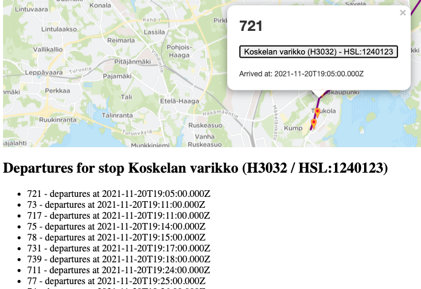
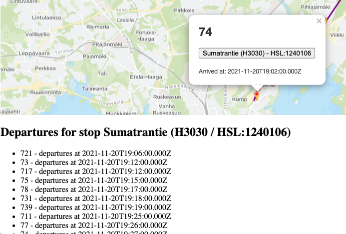

# Viikkoraportti 3

## Mitä olen tehnyt tällä viikolla?

Lisännyt docker-composeen HSL:n OpenTripPlanerin kontissa välttääkseni isojen kyselymassojen ajamista vasten HSL:n tuotanto-API:a. Samalla huomattu, että jostain syystä seuraavan pysäkin serviceDayksi, jolla lähtöaika muutetaan oikealle päivälle tulee 0 oikean sijasta - tällä hetkellä käytetään hazardisti edellisen pysäkin serviceDaytä. Voi aiheuttaa ongelmia vuorokauden vaihtuessa - korjattava löydettäessä oikeat arvot API:sta.

Ihmetellyt, että miten voi saadua pysäkille aikaisemmin kuin edelliselle on voitu saapua - aiheuttaa tällä hetkellä ylimääräisen bussin vaihdon ilman funktiota. Vaatii tarkempaa syynäystä, oletettavasti seuraavia busseja haetaan väärällä kellon ajalla. Tarkastettava myös prioriteettijonon toiminta, yksi mahdollisuus ongelmalle voi löytyä, ettei se osaa vertailla Route-olioita oikein.

Koskelan varikolle on saavuttu ajassa 1905 ja matkaa olisi viisainta jatkaa edelleen linjalla 721 samalla kellon lyömällä kohti Sumatrantien pysäkkiä. Kuitenkin jostain syystä Sumatrantielle muka saavutaankin 3 minuuttia [matkustaen ajassa taaksepäin](https://youtu.be/FWG3Dfss3Jc) ajassa 1902 linjalla 74. Ei selity myöskään Koskelan varikkoa edeltäneellä pysäkillä Viikillä, sillä sinne on saavuttu linjalla 721 ajassa 1901 ja on myös jatkettu eteenpäin linjalla 721. Ongelma on siis Koskelan varikon pysäkiltä ja sen seuraavien vuorojen tarkastelun kanssa.

## Miten ohjelma on edistynyt?

Tiivistetysti tällä viikolla:

-   alkeellinen käyttöliittymä, jolla voidaan määrittää lähtö- ja kohdepysäkit haettavalle reitille, sekä löytyneen reitin visualisointi. Käyttöliittymästä myös mahdollisuus katsella pysäkiltä saapumisaikaan lähteviä linjoja.
-   ensimmäinen versio reitinhakualgoritmistä, joka oikeasti löytää edes jonkin reitin perille.
-   reittiä kuvaava Route-olio tarkoituksenmukaiseen kuntoon
-   Viiden minuutin ikoni merkitsemään pysäkkiä, kun React-Leafletin oletus oli rikki.
-   

## Mitä opin tällä viikolla / tänään?

Create React Appin pohjalta tulevassa package.jsonissa on browserslist-asetukset siten, että Leafletin ja monen muun pakkauksen tuominen hajoaa syystä, että Babel ei tunnista `??` -operaattoria. [Fiksi.](https://github.com/facebook/create-react-app/issues/9468#issuecomment-927159449)

## Mikä jäi epäselväksi tai tuottanut vaikeuksia? Vastaa tähän kohtaan rehellisesti, koska saat tarvittaessa apua tämän kohdan perusteella.

Tällä hetkellä tilanne vielä vakaa, katsotaan uudelleen lähdettäessä selvittämään aiemmin esille tuotua aikamatkustamista.

## Mitä teen seuraavaksi?

-   Reitinhakualgoritmin ongelmien korjaamista ja testien kirjoittaminen.

-   Prioriteettijonon toteutuksen aloittaminen.

-   Refaktorointia ja järkevöittämistä - tällä hetkellä hyvin paljon ylimääräistä koodia, jolla ei välttämättä ole enää käyttötarkoitusta tai toteuttamisen voisi tehdä huomattavasti järkevämmin.

-   Jos aikaa jää, niin ensimmäinen staging-versio sovelluksesta verkkoon käytettäväksi omalle palvelimelle (alkuperäinen ajatus oli pyörittää Herokulla, mutta oman instanssin API:sta käyttämisen takia pyöritettävä omalla VPS-palvelimella).

## Työajat

| SU  | MA  | TI  | KE  | TO  |  PE | LA    |
| --- | --- | --- | --- | --- | --- | ----- |
| 1h  |  0h |  0h | 0h  | 0h  | 7h  | 11,5h |
